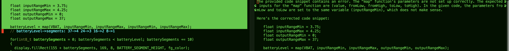
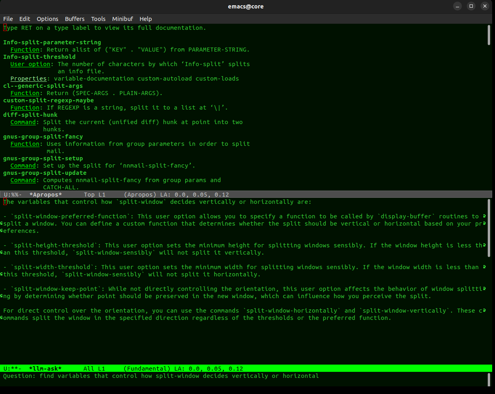

Introducing the New llm.el Package for Emacs
====================================================

Are you looking for a powerful and flexible way to integrate a command-line language model (LLM) into your Emacs
workflow? Look no further than the new `llm.el` package! This package provides a set of functions for interacting with
an LLM from within Emacs, allowing you to easily incorporate its capabilities into your editing tasks.

Getting Started
---------------

To use the `llm.el` package, you will need to have an LLM installed and accessible from the command line. You will also
need to customize the `llm-rewrite-script-path` variable to point to the script that invokes your LLM.

Once you have set up your LLM and customized the `llm-rewrite-script-path` variable, you can begin using the `llm.el`
functions.


## Example


## M-x functions
Here is a brief overview of the main functions provided by the package:

### `llm-ask`
The `llm-write` function respondes in the `*llm-ask*` buffer based on the prompt and current region or buffer.

### `llm-write`

The `llm-write` function writes a new buffer based on the prompt and current region, as well as the output of the
`llm-rewrite-script-path` command. This function is useful for generating new text based on a given prompt and context.

Here is an example of how to use the `llm-write` function:

```lisp
(llm-write "Write a blog post about Emacs:" (point-min) (point-max))
```

This will create a new buffer containing a blog post about Emacs, using the current buffer as context.

### `llm-summarize-buffer`

The `llm-summarize-buffer` function summarizes the current buffer using the LLM. This function is useful for quickly
getting a summary of a large buffer.

Here is an example of how to use the `llm-summarize-buffer` function:

```lisp
(global-set-key (kbd "M-s $") 'llm-summarize-buffer)
```

This will bind the `llm-summarize-buffer` function to the `M-s $` key sequence, allowing you to quickly summarize the
current buffer by pressing the key sequence.

### `llm-todo`

The `llm-todo` function rewrites the current region using the LLM, focusing on 'todo' comments.


### `llm-rewrite`

The `llm-rewrite` function rewrites the current region using the LLM. This function is useful for revising or expanding
text within the current buffer.

Here is an example of how to use the `llm-rewrite` function:

```lisp
(llm-rewrite)
```

This will rewrite the current region using the LLM, replacing the region with the LLM's output.

### `llm-explain-output`

The `llm-explain-output` function is used in `comint-mode` to understand and explain the output in
an interactive way. It prompts the user with a default question, "What line number contains the
proximal error?", or a custom prompt quetsion, if provided. It then uses the output between the last two
output boundaries to generate an explanation through the llm-ask function.

By default, it is bound to `M-s x` when you are in `comint-mode`:

```lisp
(global-set-key (kbd "M-s x") 'llm-explain-output)
```

Comint mode others a few other functions to operate on recent output. Comint also offers automated filters, but this
keybinding gives manual, rahter than automatic, control over access to Emacs `M-x shell` output.

### `llm-apropos`
Reflective function for asking about Emacs symbols, for programming and using Emacs Lisp and M-X commands.
Implemented in the obvious way, calling the underlying Emacs `apropos` function and operating on the output.



### `llm-describe-function`
Reflective function for asking about Emacs symbols, for programming and using Emacs Lisp and M-X commands.
Implemented in the obvious way, calling the underlying Emacs `describe-function` and operating on the output.

### `llm-load-model`
`M-x llm-load-model` loads the specified LLM.

### `llm-query-replace`
`M-x llm-query-replace` uses the LLM to generate replacement text for occurrences matching a specified regular expression in the buffer, based on a user-provided prompt.

Conclusion
----------

The `llm.el` package provides a powerful and flexible way to integrate an LLM into your Emacs workflow. With its set of
functions for interacting with an LLM, you can easily incorporate its capabilities into your editing tasks. Whether you
want to generate new text, summarize a buffer, or revise existing text, the `llm.el` package has you covered. So why
wait? Give it a try today!
